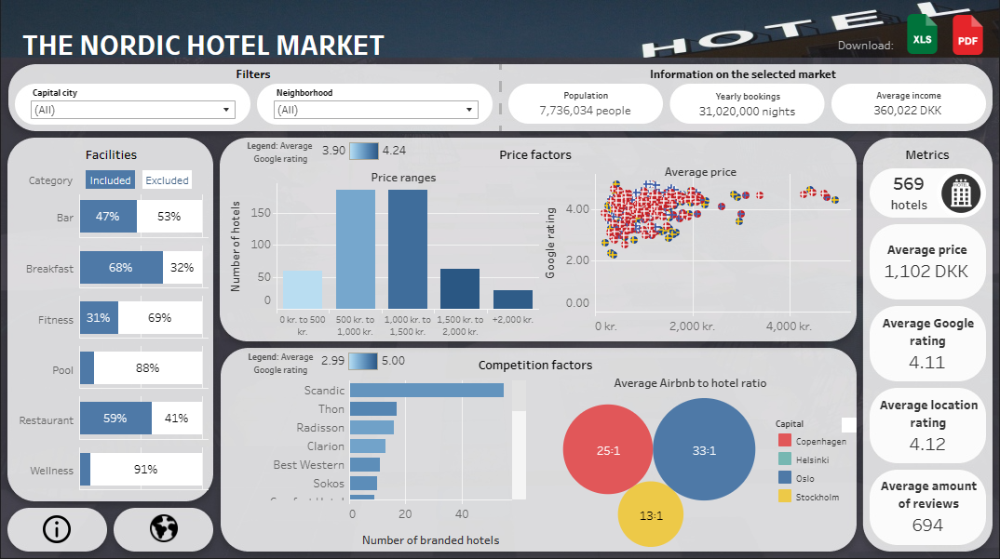
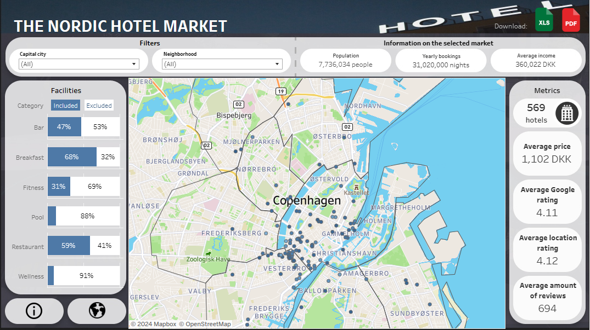

**Course Name: Visual Analtyics (Business Intelligence)**
* Project Title: Web Scraping for Automated Market Analysis - Leveraging Google Maps for Decision-Making in the Nordic Hotel Market 
* Deliverable: Tableau dashboard based on data scraped from Google maps using a Python script
* Course ID: CDSCO1003E
* Tools, languages and libraries: Tableau, Python (Beautiful Soup, Selenium, Pandas), Alteryx
* Authors: Mads Hvidberg, Michel Meyer, Nikolaj Petersson, Tim Becker 

Link to the dashboard on Tableau Public: [link](https://public.tableau.com/app/profile/mads4252/viz/Nordichotelmarketanalysis/Dashboard) (please note that different screen sizes and browsers may interrupt with the layout - tested on a 27" monitor in Microsoft Edge).

**The front page of the dashboard:**

**The front page with the map toggled on:**
